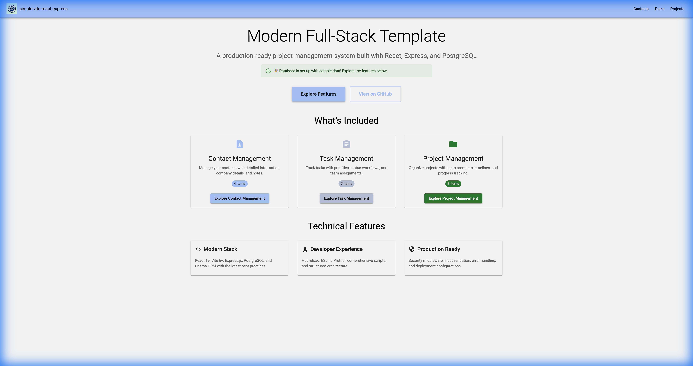
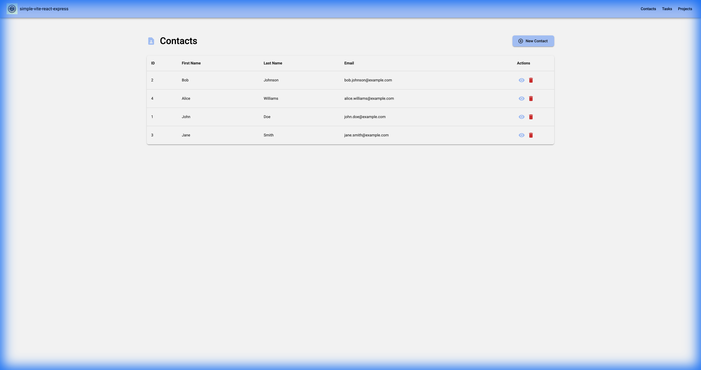
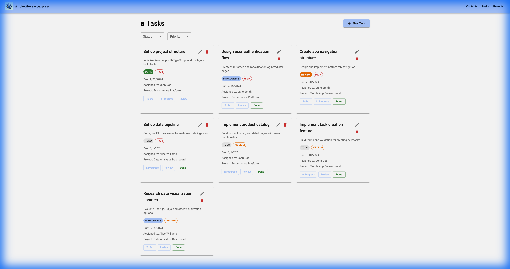
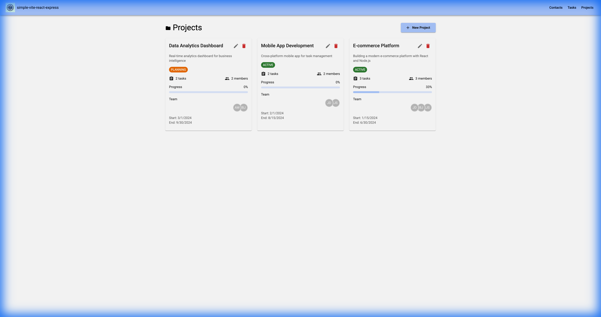

# Simple Vite React Express

<p align="center">
  
</p>

<p align="center">
  
  
  
  
  
  
</p>

A production-ready full-stack template with working examples. Unlike most starter templates that provide empty files, this one includes actual CRUD operations, database relationships, and form handling patterns.

**Version 2.0** | [Changelog](CHANGELOG.md)

---

## Table of Contents

- [Quick Start](#quick-start)
- [Using as a Template](#using-as-a-template)
- [Project Structure](#project-structure)
- [Available Scripts](#available-scripts)
- [Architecture](#architecture)
- [API Reference](#api-reference)
- [Screenshots](#screenshots)
- [Troubleshooting](#troubleshooting)
- [Contributing](#contributing)
- [License](#license)

---

## Quick Start

**Prerequisites:** Node.js 20+, PostgreSQL

```bash
# Clone the repository
git clone git@github.com:Avinava/simple-vite-react-express.git my-project
cd my-project

# Install dependencies
npm install

# Run interactive setup
npm run setup

# Start development servers
npm run dev
```

Open [http://localhost:3000](http://localhost:3000) to view the application.

The template includes a demo CRM with:
- Contact management with CRUD operations
- Task tracking with status workflows
- Project organization with team assignments
- PostgreSQL database with relationships

---

## Using as a Template

### Starting a New Project

```bash
# Clone without git history
npx degit Avinava/simple-vite-react-express my-project
cd my-project

# Initialize git
git init
git add .
git commit -m "Initial commit"

# Setup and run
npm install
npm run setup
npm run dev
```

### Customization Steps

1. Update `package.json` with your project name and details
2. Replace `/public/template-logo.png` with your logo
3. Update the title in `index.html`
4. Modify `src/client/theme/theme.js` for your color scheme

### Removing Demo Code

| Component | Location | Action |
|-----------|----------|--------|
| Database schema | `prisma/schema.prisma` | Replace with your models |
| API routes | `src/server/routes/v1/` | Replace with your routes |
| Business logic | `src/server/services/` | Replace with your services |
| Pages | `src/client/pages/` | Replace with your pages |
| Hooks | `src/client/hooks/` | Customize for your data |
| Services | `src/client/services/` | Customize for your API |

---

## Project Structure

```
src/
├── client/                    # Frontend (React + Vite)
│   ├── components/            # Reusable UI components
│   ├── context/               # React contexts
│   ├── hooks/                 # Custom hooks (useContacts, useTasks, etc.)
│   ├── pages/                 # Route components
│   ├── services/              # API service layer
│   ├── theme/                 # Material-UI theme
│   └── __tests__/             # Client tests
│
└── server/                    # Backend (Express)
    ├── config/                # Centralized configuration
    ├── middleware/            # Security, validation
    ├── routes/                # API route definitions
    ├── services/              # Business logic
    └── utils/                 # Utilities

prisma/                        # Database
├── schema.prisma              # Schema definition
├── migrations/                # Migration history
└── seed.js                    # Sample data

scripts/                       # Setup utilities
```

---

## Available Scripts

### Development

| Command | Description |
|---------|-------------|
| `npm run dev` | Start client and server concurrently |
| `npm run client` | Start Vite dev server only |
| `npm run server` | Start Express with Nodemon |
| `npm run server:debug` | Start with Node inspector |
| `npm run setup` | Interactive project setup |
| `npm run clean` | Clear build artifacts |

### Database

| Command | Description |
|---------|-------------|
| `npm run db:setup` | Run migrations and generate client |
| `npm run db:migrate` | Run pending migrations |
| `npm run db:generate` | Regenerate Prisma client |
| `npm run db:studio` | Open Prisma Studio GUI |
| `npm run db:reset` | Reset database |
| `npm run db:seed` | Seed with sample data |

### Testing

| Command | Description |
|---------|-------------|
| `npm test` | Run tests in watch mode |
| `npm run test:run` | Run tests once |
| `npm run test:coverage` | Generate coverage report |

### Code Quality

| Command | Description |
|---------|-------------|
| `npm run lint` | Check for linting issues |
| `npm run lint:fix` | Auto-fix linting issues |
| `npm run format` | Format with Prettier |
| `npm run format:check` | Check formatting |

### Production

| Command | Description |
|---------|-------------|
| `npm run build` | Build for production |
| `npm start` | Start production server |
| `npm run preview` | Preview production build |

---

## Architecture

### Frontend Stack

- **Vite 6** - Build tooling with hot module replacement
- **React 19** - UI library with latest features
- **Material-UI 6** - Component library with theming
- **React Router 7** - Client-side routing
- **Formik + Yup** - Form handling and validation
- **Axios** - HTTP client with interceptors

### Backend Stack

- **Express 5** - Web framework
- **Prisma 7** - Type-safe ORM with adapter pattern
- **PostgreSQL** - Database
- **Celebrate/Joi** - Input validation
- **Helmet** - Security headers
- **Rate Limiting** - Request throttling

### Code Quality

- **ESLint 9** - Linting with flat config
- **Prettier** - Code formatting
- **Vitest** - Testing framework
- **React Testing Library** - Component testing

---

## API Reference

All endpoints are prefixed with `/api/v1/`.

### Contacts

```
GET    /contact/list     List all contacts
GET    /contact/:id      Get contact by ID
POST   /contact          Create contact
PUT    /contact/:id      Update contact
DELETE /contact/:id      Delete contact
```

### Tasks

```
GET    /task/list        List all tasks
GET    /task/:id         Get task by ID
POST   /task             Create task
PUT    /task/:id         Update task
DELETE /task/:id         Delete task
```

### Projects

```
GET    /project/list     List all projects
GET    /project/:id      Get project by ID
POST   /project          Create project
PUT    /project/:id      Update project
DELETE /project/:id      Delete project
```

### Response Format

```json
{
  "success": true,
  "data": {},
  "message": "Success",
  "timestamp": "2026-01-18T12:00:00.000Z"
}
```

---

## Screenshots

<div align="center">

**Homepage**



**Contact Management**



**Task Tracking**



**Project Overview**



</div>

---

## Troubleshooting

### Database Connection Failed

1. Verify PostgreSQL is running: `pg_isready -h localhost -p 5432`
2. Check `DATABASE_URL` in `.env` file
3. Run migrations: `npm run db:setup`
4. Verify database exists: `psql -l`

### Port Already in Use

```bash
# Kill processes on ports 3000 and 8080
lsof -ti:3000 | xargs kill -9
lsof -ti:8080 | xargs kill -9
```

### Hot Reload Not Working

1. Increase file watcher limit (Linux): 
   ```bash
   echo fs.inotify.max_user_watches=524288 | sudo tee -a /etc/sysctl.conf
   ```
2. Restart the dev server

### Build Issues

```bash
npm run clean
npm run build
```

---

## Contributing

1. Fork the repository
2. Create a feature branch: `git checkout -b feature/your-feature`
3. Make your changes
4. Run tests: `npm run test:run && npm run lint`
5. Submit a pull request

---

## License

MIT License - see [LICENSE](LICENSE) for details.

---

<p align="center">
  <sub>Built with <a href="https://withAntigravity.com">Antigravity</a></sub>
</p>
